<!-- HEADER -->

  

<!-- TYPING SVG -->

  

&nbsp;&nbsp;&nbsp;&nbsp;

 

<!-- ABOUT ME -->
<h2 align="center">🌟 About Me</h2>

B.Tech CSE Undergrad at RCCIIT (Class of '27), passionate about architecting <strong>enterprise-grade Agentic AI systems</strong> and <strong>distributed full-stack applications</strong>. My expertise sits at the intersection of robust software engineering, scalable cloud infrastructure, and applied machine learning.

🔭 <strong>Focus:</strong> Agentic AI (LangGraph) & End-to-End MLOps 
🌱 <strong>Learning:</strong> Distributed Systems, Real-Time WebRTC & Ethical Hacking 
💼 <strong>Experience:</strong> Architected <strong>EPIC</strong>, an AI-assisted Govt. Grievance Platform at Webel 
🎨 <strong>Hobbies:</strong> Graphic Design, Video Editing & Competitive Programming 
🏆 <strong>Awards:</strong> 2nd @ Cipher 7.0 &nbsp;|&nbsp; 3rd @ Codathon (Innovision '24)

<!-- TECH STACK -->
<h2 align="center">🛠️ Tech Stack</h2>

<h3 align="center">🧠 AI &amp; Machine Learning</h3>

<em>Machine Learning · Deep Learning · NLP · Generative AI (LLMs, RAG) · Agentic AI PyTorch · TensorFlow · LangChain · LangGraph · MediaPipe · Scikit-learn · Pandas · NumPy · Matplotlib · EDA</em>

<h3 align="center">🌐 Full-Stack &amp; Backend</h3>

<em>TypeScript · JavaScript · HTML/CSS · React.js · Next.js · Express.js · FastAPI · Flask · Streamlit · WebRTC · Socket.IO · JWT</em>

<h3 align="center">☁️ Cloud, DevOps &amp; Databases</h3>

<em>AWS (S3, EC2) · GCP · Docker · Kubernetes · Git · GitHub Actions · CI/CD · Celery · PostgreSQL · MongoDB · MySQL · Redis · FAISS · Pinecone · ChromaDB · Supabase</em>

<h3 align="center">⚙️ Languages &amp; Core CS</h3>

<em>Python · Java · C++ · C · TypeScript · JavaScript · SQL · Data Structures &amp; Algorithms · OOP · DBMS · OS · Computer Networks</em>

 

<!-- PROJECTS -->
<h2 align="center">🚀 Engineering Portfolio</h2>

<table align="center" width="100%">
<tr>
<td width="50%" valign="top">

### 🏛️ [EPIC: AI Grievance Platform](#epic-ai-grievance-platform)
Architected a distributed full-stack Govt. grievance platform. Built a hybrid 4-tier LLM triage system, LangGraph ReAct agent, and FAISS RAG pipeline. Engineered a dual-provider email sync engine and real-time SSE dashboard. Enforced enterprise security with RLS, RISC webhooks, and a VRAM mutex.

</td>
<td width="50%" valign="top">

### ⚕️ [MLOps X-Ray Classifier](https://github.com/AnshuNandi/pneumonia-xray-classifier)
Architected a custom PyTorch CNN for binary chest X-ray classification. Engineered a modular MLOps pipeline (data ingestion → augmentation → training → evaluation) and a FastAPI inference server with automated CI/CD via GitHub Actions to AWS EC2 self-hosted runners.

</td>
</tr>
<tr>
<td width="50%" valign="top">

### 🐙 [Custom VCS CLI](https://github.com/AnshuNandi/Custom-Version-Control)
Engineered a Git-like CLI (yargs) with immutable SHA hashing and AWS S3 SDK sync for version-controlled blobs. Built a REST API with JWT/bcrypt auth and a GitHub-like React dashboard featuring contribution heatmaps and Socket.IO real-time collaboration.

</td>
<td width="50%" valign="top">

### 📹 [PulseMeet: WebRTC Conferencing](https://github.com/AnshuNandi/PulseMeet)
Engineered a P2P video conferencing app using WebRTC (ICE/SDP) and a Socket.IO signaling server. Implemented screen sharing, meeting rooms, call history tracking, and token-based session management with bcrypt hashing.

</td>
</tr>
<tr>
<td width="50%" valign="top">

### 🤖 [Dum-E: AI Fitness Coach](https://github.com/AnshuNandi/Dum-E--AI-Coach)
Built a real-time CV pipeline (MediaPipe + OpenCV) computing 3D joint angles to render a live biomechanical HUD across 6 exercises. Integrated the Groq API for ultra-fast, context-aware LLM feedback and async gTTS audio cues.

</td>
<td width="50%" valign="top">

### 🛡️ [SnapRoll: Biometric Attendance](https://github.com/AnshuNandi/SnapRoll)
Engineered a multi-modal biometric system using 128-D facial embeddings (dlib + SVM) and librosa MFCC audio verification. Built a Supabase (PostgreSQL) backend with encrypted profiles, dual-role portals, and QR-code class-joining.

</td>
</tr>
</table>

 

<!-- ANALYTICS -->
<h2 align="center">📊 GitHub Analytics</h2>

  

 

  

 

<!-- SNAKE -->
<h2 align="center">🐍 Contribution Snake</h2>

  <picture>
    <source media="(prefers-color-scheme: dark)" srcset="./github-contribution-grid-snake-dark.svg" />
    <source media="(prefers-color-scheme: light)" srcset="./github-contribution-grid-snake.svg" />
    
  </picture>

 

<!-- DAILY QUOTE -->
<h2 align="center">💬 Dev Quote of the Day</h2>

  

 

<!-- FOOTER -->

  

